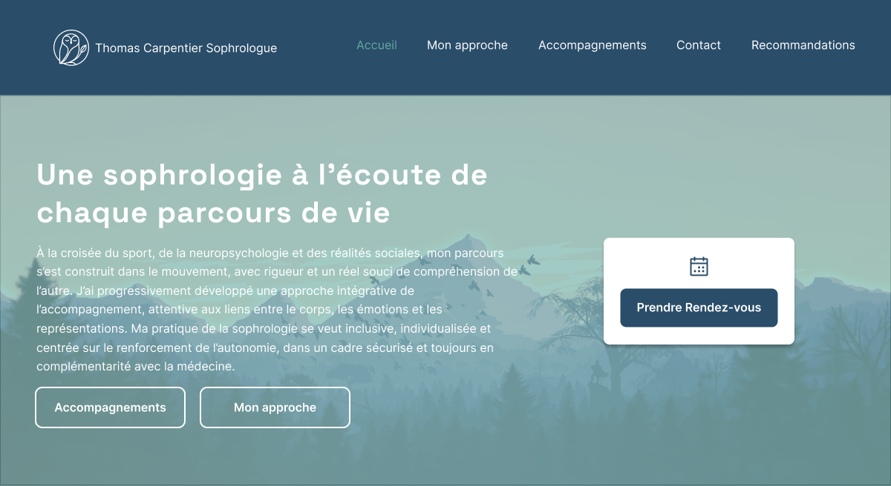

# Thomas Sophro — thomascarpentier-sophrologue.fr

> A clean, one-page website presenting Thomas Carpentier’s professional profile, services, and contact information —  
> built as a performant static site with Decap CMS for easy content management.



---

## ✨ Overview

This one-page site showcases Thomas Sophro’s expertise and offerings with sections for biography, services, testimonials, and contact details. The design focuses on clarity, responsiveness, and smooth user experience, with dynamic tab navigation and modular content components.

---

## 🛠️ Tech Stack

- **Eleventy (11ty)** — static site generator  
- **Nunjucks** — templating engine  
- **Tailwind CSS v4** — single `input.css` for styling  
- **Decap CMS** — headless CMS without database  
- **Netlify** — hosting and deployment

---

## ⚙️ NPM Scripts

```json
"scripts": {
  "start": "npx concurrently \"npx @tailwindcss/cli -i ./src/input.css -o ./public/css/output.css --watch\" \"eleventy --serve --watch\"",
  "build": "npm run update-sitemap && eleventy",
  "update-sitemap": "node src/js/utils/update-sitemap.js",
  "refresh": "rm -rf .cache ./public/css/output.css"
}
````

---

## 📁 Project Structure

* `src/` contains the source files

  * `_data/`, `_includes/`, `js/` follow the **OMA** (Organism, Molecule, Atom) structure
  * `input.css` holds the Tailwind CSS configuration
  * `admin/` includes Decap CMS configuration
* `public/` is the output folder for the built site
* `.eleventy.js` is the Eleventy configuration file
* Root files: `robots.txt`, `sitemap.xml`, `LICENSE`, and `README.md`

---

## 🚀 Getting Started

Run the following commands to install dependencies and start the development server:

```bash
npm install
npm run start
```

Open your browser at [http://localhost:8080](http://localhost:8080) to view the site locally.

---

## 📝 Content Management

Content can be edited easily via **Decap CMS** at the `/admin` route, enabling updates without needing a database and tracking changes automatically with Git.

---

## 📬 Contact & License

* Developed by Charlotte Carpentier — [carpentier.dev@gmail.com](mailto:carpentier.dev@gmail.com)
* Licensed under MIT
  

---
